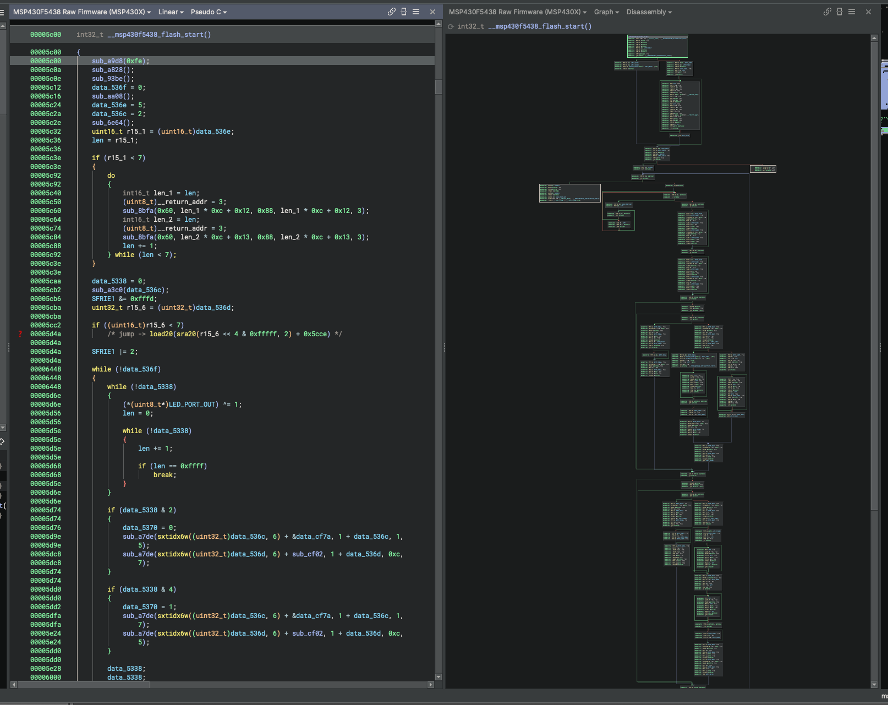
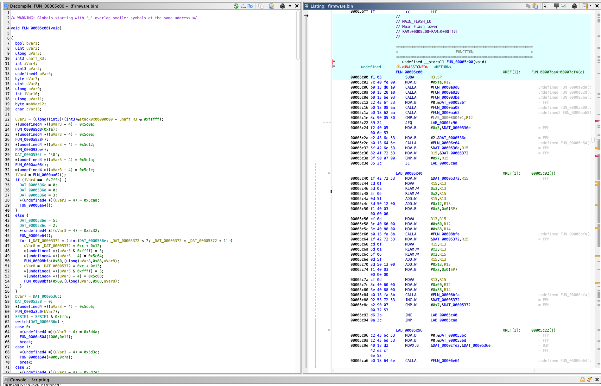

# MSP430X Lens

MSP430X Lens adds MSP430X firmware support to Binary Ninja, with a focus on the
MSP430F5438/MSP430F5438A MCUs. It was written with the ability to ingest raw firmware
images; however having an ELF will make analysis much easier. MSP430X Lens's
core features include:

- `MSP430X` ISA support; lifting the MSP430/MSP430X CPUX forms for better analysis (duh)..
- Ability to map raw firmware MSP430F5438/F5438A images. TI-TXT/ELF firmware is supported if available.
- Vector-table seeding, Flash/RAM/Peripheral sections, and typed TI SFR labels.
- Typed factory TLV calibration/device records with stored CRC16 validation.
- Collapsing and simplifying the decompilation output without all the
artifacts that Ghidra generally leaves.
- Pure Python. No external dependencies used making porting and installation easier.

## Binary Ninja + MSP430X Lens vs. Ghidra

The same function (`__msp430f5438_flash_start` at `0x5c00`) from the same raw
firmware image, decompiled with MSP430X Lens on Binary Ninja versus Ghidra's
stock MSP430 support:

| Binary Ninja + MSP430X Lens | Ghidra |
| --- | --- |
|  |  |

Ghidra's decompiler declares a page of `undefined`/`uVar`/`unaff_R3`-typed
locals up front and replays every `CALLA` as manual stack-pointer writes
(`*(undefined4 *)(uVar3 - 4) = 0x5c0a; FUN_0000a9d8(0xfe);`), plus a stale
`_`-prefixed global overlap warning at the top of the listing. The loop it
recovers keeps a raw memory-mapped counter (`_DAT_00005372`) instead of a
local variable.

MSP430X Lens's simplification passes collapse that same code to
`sub_a9d8(0xfe)` calls, typed factory globals (`data_536e` instead of
`DAT_0000536e`), and a `do`/`while` loop with real induction variables
(`len`, `len_1`, `len_2`). The output reads close to the original C rather
than a disassembly transcript with the artifacts Ghidra leaves behind.

## Agentic Augmented

The beginning of this project (i.e lifting) was written by hand to ensure the correct
semantics were being preserved. Since the core of this plugin has been constructed;
agentic programming is utilized. Agentic code should still be read in full,
keeping technical debt to a minimum. If you would like to contribute to this plugin
please read the [CONTRIBUTION](./CONTRIBUTION.md). It contains guidance on how
agentic code should be utilized if you choose to use it.


## Install

Once the plugin is listed in the Binary Ninja Plugin Manager, install it from
`Plugins -> Manage Plugins`, then restart Binary Ninja. Architecture and
BinaryView plugins are loaded at startup.

For a manual development install, clone the repository and copy or symlink it
as a directory named `msp430xlens` under the Binary Ninja user plugin
directory:

- macOS: `~/Library/Application Support/Binary Ninja/plugins/msp430xlens`
- Linux: `~/.binaryninja/plugins/msp430xlens`
- Windows: `%APPDATA%\Binary Ninja\plugins\msp430xlens`

Restart Binary Ninja after installing. To uninstall a manual installation,
remove only the `msp430xlens` directory or symlink you created.

Do not leave both a Plugin Manager installation and a development symlink
enabled. Binary Ninja registers Architecture/BinaryView plugins at startup, so
two copies make behavior depend on load order. Disable the Plugin Manager copy
while testing a checkout, then restart Binary Ninja.

The plugin has no third-party Python dependencies. It requires Binary Ninja
5.3.9757 or newer.

## Quick Start

Open raw firmware with the mapped view type:

```text
MSP430F5438 Raw Firmware (MSP430X)
```

The mapped view creates segments, sections, header labels, interrupt vectors,
and entry points before Binary Ninja's first analysis pass. Avoid opening as
plain `Raw`, analyzing, and then retrofitting the map.

ELF executables open through Binary Ninja's normal `ELF` view. The plugin
selects the `msp430x` platform before initial analysis while preserving the
ELF's segments, sections, permissions, symbols, and existing function types.
Absolute F5438/F5438A annotations are added automatically only when a valid
factory TLV block identifies the device. If an ELF omits TLV data, set `MSP430
ELF Device Profile` in Open With Options (or Binary Ninja Settings) before
opening it to force the matching revision, or use that device menu's `Re-run
MSP430X analysis` command afterward.
Relocatable `.o` files receive the architecture selection but not absolute
device annotations.

Best path for a raw dump:

1. Install the plugin and restart Binary Ninja.
2. Open the firmware with view type `MSP430F5438 Raw Firmware (MSP430X)`.
3. Use `Tools -> MSP430F5438 -> Diagnose active view`.
4. Use `Tools -> MSP430F5438 -> Re-run MSP430X analysis` after editing the
   lifter, importing symbols/types, or refreshing vector functions.

Commands live under:

```text
Tools -> MSP430F5438
Tools -> MSP430F5438A
```

Useful commands include:

- `Register mapped raw firmware view`
- `Apply memory map (auto base)`
- `Apply memory map (main flash @ 0x5c00)`
- `Apply memory map (full image @ 0)`
- `Diagnose active view`
- `Report CPUX fallback instructions`
- `Report TLV device descriptors and CRC16`
- `Re-run MSP430X analysis`
- `Apply MSP430 header labels`

If you accidentally run an `Apply memory map` command on an already mapped
`MSP430F5438 Raw Firmware (MSP430X)` view, the plugin refreshes
architecture/vector analysis without rebuilding segments.

## UI Smoke Test

After installing or changing plugin registration code:

1. Restart Binary Ninja.
2. Open firmware as `MSP430F5438 Raw Firmware (MSP430X)`.
3. Confirm the view title contains `MSP430F5438 Raw Firmware (MSP430X)`.
4. Confirm the architecture/platform shown by the view is `msp430x`.
5. Confirm `Tools -> MSP430F5438` commands are present.
6. Run `Tools -> MSP430F5438 -> Diagnose active view`.
7. Spot-check that reset/vector labels and header-derived peripheral labels are present.
8. For an unused peripheral read, confirm Pseudo C retains a side-effecting
   expression such as `mmio_read16(&DMACTL0)` instead of deleting the access.

If the options dialog shows ARM/Thumb, close that view and reopen with the
exact MSP430F5438 view type. The generic firmware loader is not this plugin.

## Workflow Notes

If a suspicious `cpux 0x....` mnemonic appears in code, use
`Tools -> MSP430F5438 -> Report CPUX fallback instructions`. It reports only
fallback decodes that still live inside analyzed functions, which helps separate
missing lifter coverage from lookup tables or strings that merely look like
opcodes when viewed as linear bytes.

On the `MSP430F5438` tab in `Open With Options`, the read-only `Platform` load
option should show `msp430x`. If it still shows `thumb2`, restart Binary Ninja
after reinstalling the plugin so stale registrations are gone.

The interrupt vector table is forced into 64 separate two-byte `uint16_t` data
entries, with each populated target still seeded as a reset/ISR function.
Image-base autodetection scores candidate vector tables, so a 64 KiB
low-address image with vectors at file offset `0xff80` opens at base `0`, while
a main-flash slice still opens at base `0x5c00`.

Long erased flash spans (`0xff`) are marked as non-executable data when the
mapped view is created. If analysis has already produced many tiny functions in
erased flash, restart Binary Ninja and reopen the firmware as
`MSP430F5438 Raw Firmware (MSP430X)` so the split map is present before initial
analysis.

Small backed code islands between those erased spans are also seeded as
functions when they have a conservative MSP430 prologue-and-return shape. This
is done during initial mapped-raw loading and by `Re-run MSP430X analysis` for
existing mapped or ELF views, including executable segments outside the
F5438-specific flash range.

Printable, null-terminated ASCII runs in flash are defined as data during
mapped-view creation. Re-running analysis also removes stale functions that
start inside those strings or in short zero padding next to them, which prevents
string tables from decompiling into noisy carry/flag-heavy pseudocode or tiny
`bra @pc` functions.

Binary Ninja can also hide a valid string load when an untyped callee is
auto-inferred with no parameters or with false R4-R10 inputs from its
save/restore prologue: the call prototype omits R12, so HLIL removes the proven
R12 assignment as dead. After initial analysis completes for a mapped-raw or
prepared ELF view, MSP430X Lens automatically recovers direct CALL/CALLA sites
whose R12 value points to a fully backed, printable C string. It adds a durable
local call-site type adjustment to the proven call (and recognizes format
strings) while retaining uncertain auto-inferred inputs and no-return behavior.
The callee's global type,
user-authored types, and existing call-site adjustments are never replaced.
Recovery runs as a separate background task and synchronously confirms a fixed
point through bounded incremental passes, so the analysis-completion callback
itself never waits for analysis. The durable adjustment is stored with a BNDB
as a user call-site override. Reopened MSP430X ELF databases also receive the
automatic pass, including older databases that predate the recovery feature.
`Re-run MSP430X analysis` remains available after importing symbols/types or
when refreshing an older already-open view. Long map/re-run menu commands use
the same background-task path so analysis never blocks the UI thread.

To keep random firmware bytes out of Binary Ninja's Strings sidebar, the mapped
raw and ELF loaders raise the inherited `analysis.limits.minStringLength`
setting from four to eight before initial analysis. Explicit User, Project, and
distinct Resource values are preserved. Binary Ninja does not rediscover
strings during ordinary reanalysis, so reopen the original firmware after
changing this setting or updating the plugin; an existing BNDB keeps its
previously discovered strings.

After importing external symbols or types, such as names recovered from a
Ghidra project, use `Tools -> MSP430F5438 -> Re-run MSP430X analysis`. This
refreshes vector entry points, removes boundary data symbols that collide with
real functions, and reapplies the MSP430X calling convention used for imported
function prototypes.

MSP430 header labels are applied automatically during mapped-view creation and
analysis refresh. The parser reads headers under `inc/`, plus any paths listed
in `MSP430_HEADER_PATHS` separated by your shell path separator. It recognizes
TI-style `sfrb`/`sfrw`/`sfra` register definitions, module base labels, vector
labels, TLV labels, and simple aliases such as board/HAL names that point at a
known register label. SFR declarations also become width-correct volatile data
variables. Direct reads of those variables lift as side-effecting
`mmio_read8`/`mmio_read16`/`mmio_read20` operations so an unused hardware read
remains visible in Pseudo C; ordinary RAM and flash reads retain normal load
semantics.

When bytes at `0x1a00-0x1aff` are present, the mapped-raw and ELF loaders read
the factory device descriptors before their first analysis pass. A CRC-valid
supported device ID permits exact automatic variant selection on ELF. For
another custom view, or an ELF without enough evidence, set `MSP430 ELF Device
Profile` in Open With Options (or Binary Ninja Settings) before opening it, or
use the matching F5438/F5438A `Re-run MSP430X analysis` command. The info block,
die record, ADC12 calibration, reference calibration, and known record layouts
receive packed types; peripheral discovery and unknown records remain bounded
byte arrays. The report command lists every discovered peripheral, including
the CRC16 interfaces advertised by the device.

The stored word at `0x1a02` is checked as CRC-16/CCITT-FALSE over
`0x1a04-0x1aff`. A mismatch is reported and left visible but does not hide
structurally safe calibration fields. Main-flash-only dumps normally do not
contain this range, so `tlv=absent` is expected and the loader deliberately does
not interpret zero-filled, unbacked memory as factory data. A CRC-valid backed
device ID also selects F5438 versus F5438A automatically for the mapped raw
view.

The checksum and descriptor layout follow TI's
[MSP430x5xx/6xx Family User's Guide](https://www.ti.com/lit/ug/slau208q/slau208q.pdf).

## Test

Run all Binary Ninja-backed unit and loader-integration tests:

```sh
make test
```

Generate deterministic main-flash and full-address-space images for visual
testing with `make fixture`.
More details, including the guarded `make dev-link` setup, are in
[docs/TESTING.md](docs/TESTING.md).

## Known Limitations

The automatic raw-firmware memory map targets MSP430F5438/F5438A devices. The
`msp430x` architecture can still be selected for other MSP430X firmware, but
device-specific sections and peripheral symbols must be supplied separately.

The implementation status and deliberately conservative CPUX fallbacks are
tracked in [docs/CPUX_SIDE_EFFECT_AUDIT.md](docs/CPUX_SIDE_EFFECT_AUDIT.md).

## License

The plugin is released under the [MIT License](LICENSE). Bundled Texas
Instruments headers retain their BSD 3-Clause terms; see
[THIRD_PARTY_NOTICES.md](THIRD_PARTY_NOTICES.md).
